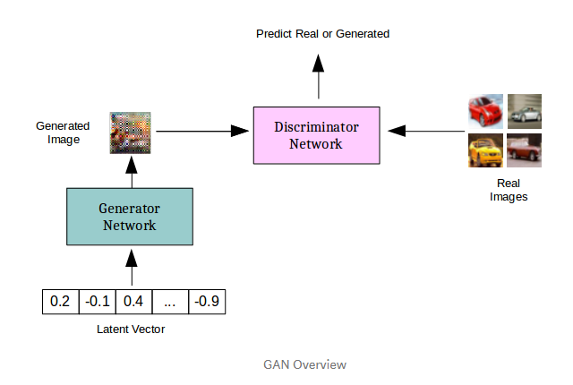
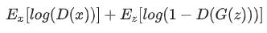
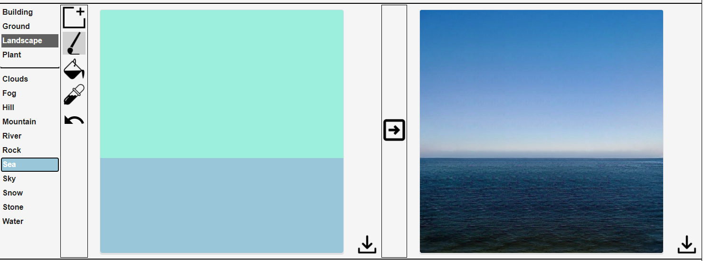
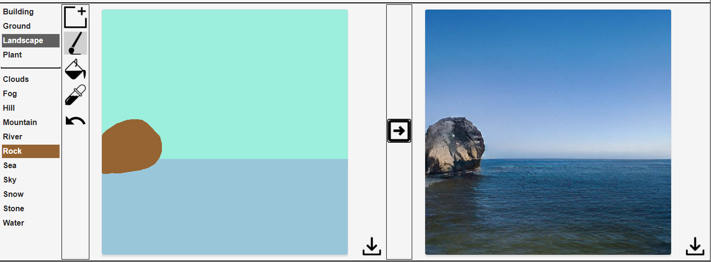
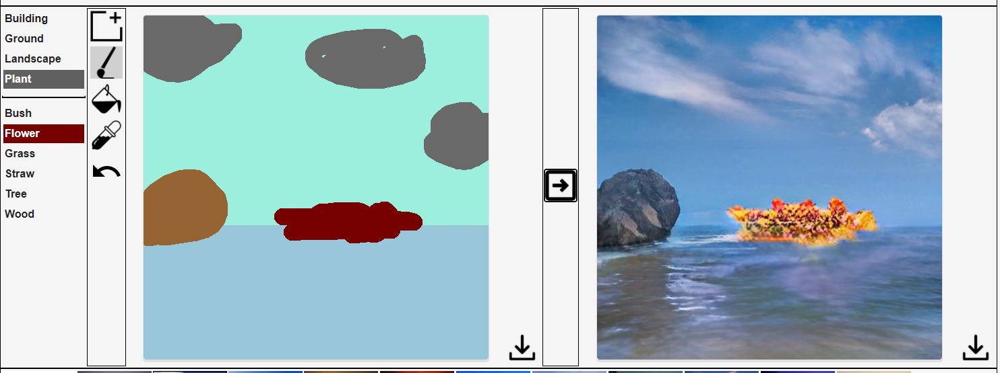

# Adversarial Learning
This report, I spent much less time in this category, but still poked around a few resources.

## Intro to GANs
Although I have read about how GANs work in the past, I wanted to do a refresher and read about the basics of how they work.

GANs, or Generative Adverserial Networks are actually two networks that are pitted against each other. Given a dataset, the generator network takes in a random vector and tries to generate an example that follows the same distribution as the training set. This random input is simply noise, and is meant to place the generator in a different part of the training data's distribution. It has been shown that this input does not matter much (Depending on use case) and can be used to explore different areas of the space. At the same time, a discriminator network is a binary classifier that tries to predict if a given image was generated or was apart of the training set. The networks are pitted against each other *adversarially*, so that as one gets better, so does the other. Eventually, if done right, the generated images get to be so good that even humans cannot distinguish the image (see [this person does not exist](https://thispersondoesnotexist.com) for a crazy example).





## Training
What is important to note is that the task of a Generator is much harder than that of the discriminator. When training, each network is trained in an alternating fashion. Each network is fixed while the other is training, since the output of one influences the training of the other. Note that the discriminator must work early on, so that the training can get started. The performance of the discriminator should converge to 50%, since the generator should be getting better. This is a bit counter-intuitive since we are used to our classifiers increasing their accuracy, but in this case it should be decreasing. This raises an interesting problem: if the discriminator starts getting *too* bad, then the generator starts to diverge, and the quality may collapse.

## Loss Function
The loss function used is an active area of research. In the original Goodfellow paper on GANs, the loss used is called Minimax Loss:



Where *D* and *G* are the Discriminator's and Generator's output, respectively. The generator tries to minimize the function, while the discriminator tries to maximize it. This is the core intuition behind the adversarial nature, they are both pulling the loss function in opposite directions. There are problems though: the loss can get stuck if the discriminator is too good, so the authors suggest using a modified minimax loss, where the generator tries to maximize *log(D(G(z)))* instead. Another way to get stuck is if the generator finds a single example that works well, it will learn to only output that example. Usually, the discriminator can learn to always reject that sample,  but it is possible that it is stuck in some local minimum. This is known as **Mode Collapse**.  

## Interpolation of Latent Space
Another really cool application of GANs is the interpolation through the latent space of the generator. It makes for some really intersting videos, that I would love to be able to generate at some point. For example, [this](https://www.youtube.com/watch?v=djsEKYuiRFE&ab_channel=NolanStrait) video, (based on the paper [here](https://github.com/tkarras/progressive_growing_of_gans)). The problem is that these networks take a long, long, long time to train. The example linked recommends a NVIDIA DGX-1 with 8 Tesla V100 GPUs, which costs **$129,000**, and even with that high end of a GPU, takes 2 weeks. It may be possible to experiment with smaller data such as MNIST.


## Resources
- https://medium.com/@utk.is.here/keep-calm-and-train-a-gan-pitfalls-and-tips-on-training-generative-adversarial-networks-edd529764aa9

- https://towardsdatascience.com/interpolation-with-generative-models-eb7d288294c

- https://developers.google.com/machine-learning/gan/


## Some random links that I found awesome:
- http://nvidia-research-mingyuliu.com/gaugan/
    - An NVIDIA called the GauGAN project that allows you to draw with different "category" paint brushes, and then generates an image. Such an amazing application of GANs. Example of drawing steps and results:

    Starting out with a sea and a sky:
    
    Adding a rock:
    
    Adding clouds and a random patch of flowers:
    

    Although not perfect, it is still incredible how by just specifying the type of object and giving a really rough size and location, a brand new image is created. [Here](https://arxiv.org/pdf/1903.07291.pdf) is a link to the paper, which I skimmed. What is really cool is that they apply both generative models and style transfer to obtain good results. As I get more into GANs, I would love to try and train a similar network.

- https://play.aidungeon.io/main/landing
    - A game that uses GPT-3 (not a GAN) to generate scenarios and adaptively create an interactive storyline. It works incredibly well. Even giving it prompts that seem to be unrelated, it doesn't throw the model off, and it responds well! For example, in a game where the quest was to defeat a dragon and get a pot of gold, this is what I did (note that the text after '>' is my input,and then the other text is generated):
    ```
    > You start to melt the gold down.
    You place the gold in a large pot and put it on a fire. As soon as it touches the pot it turns to liquid nitrogen, a liquid so cold that it makes your skin tingle.

    > You sell it to buy a private jet.
    You carry the pot of gold out of the cave and into a nearby city. You find the nearest alchemist and sell the pot of gold for a large amount of money.
    ```
    The answers actually make sense, and were sometimes really funny. This made me think of the future of gaming, where the game is generated uniquely for you.

- http://www.cs.columbia.edu/~vondrick/tinyvideo/
    - Really cool paper on GANs used to generate video, which adds a whole bunch of extra difficulty
- https://medium.com/@jonathan_hui/gan-some-cool-applications-of-gans-4c9ecca35900
    - A comprehensive overview of new applications of GANs. I especially like 3DGAN.