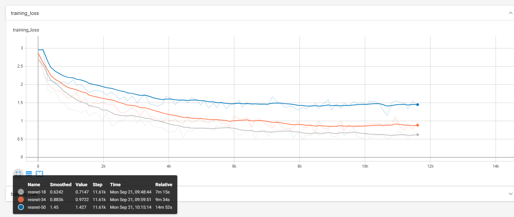

# Playing Around with ResNet
I spent the largest chunk of time for this report using PyTorch to implement ResNet from scratch. This was an incredibly valuable experience, as I now feel much more comfortable implementing some of the networks we study in class.

- [notebook](./resnet.ipynb)
- [standalone training script](./train.py)
- [tensorboard examples](./tensorboard-experiments.md)

A breif summary of what I did:
- Using a more modular-based method to construct a network. By subclassing `nn.Module`, it was possible to write much cleaner code that was super flexible. The objects I created were sized dynamically, and take inputs to configure them so that they could be reused efficiently.
- Debugging a network that doesn't work: As careful as we are when designing our networks, sometimes when we go to implement them, we can make mistakes. Learning how to narrow down where the issue is and how to fix it is a valuable skill
- Using powerful tools like [Tensorboard](https://www.tensorflow.org/tensorboard). Tensorboard is one of the best things I have found to aid in doing anything with deep learing. I used it for work a few years ago, and also never used it with PyTorch. So, as a refresher as well as a learning experience in a new framework, I spent time visualizing the model, the training, PR curves, etc. Some screengrabs can be found [here](./tensorboard_experiments.md)

In the end, I most likely did something wrong when creating the model. The accuracy of my best ResNet model was around 50% on CIFAR10. In the paper, ResNet56 has an **error** percent of 6.97%. This is a huge discrepancy. Some reasons may be:
- Mistake in my model
- More data augmentation
- Cascade of models, taking best performance
- Much more hyperparam tuning

One thing that I would like to look into is the `torch.optim.lr_scheduler.MultiStepLR`, since my first intuition is that there is something I am doing wrong with setting that up. I tried training for a long time, and my loss flattened out (as expected), but then didn't drop again as it should (see image below). I know there are ways to automatically decay the learning rate based on the loss, instead of just picking a fixed epoch. This would probably work better.

For my next report, I want to fine tune my model to try and get it to perform the same as the paper. This will involve much more careful inspection of the model, of the hyperparams, and of the data augmentation. In addition, I would love to try out training on ImageNet, and thus using a larger image size. I also think it would be valuable to use a cloud computing platform. I have a 1080 TI GPU in my PC which is pretty good, but leveraging the compute of AWS/Azure/Google Cloud could be a good learning experience and could speed things up greatly
