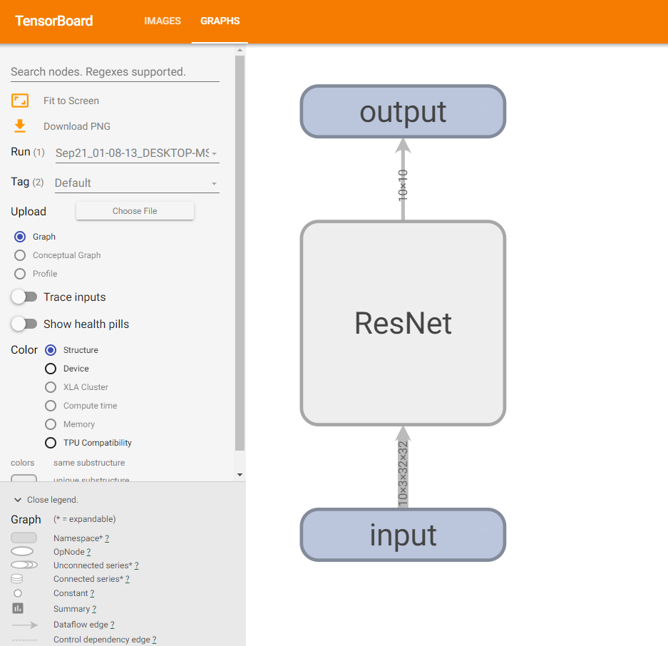
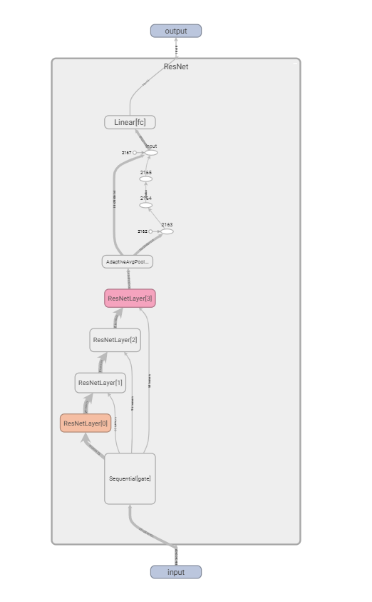
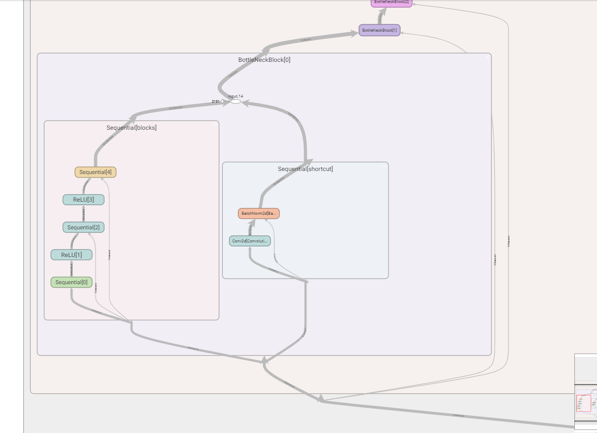
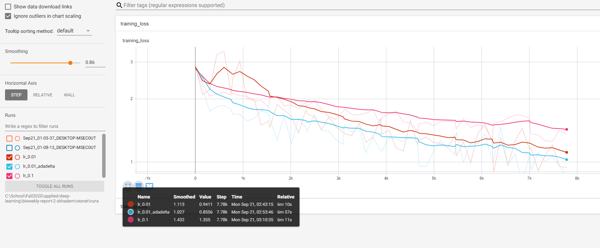
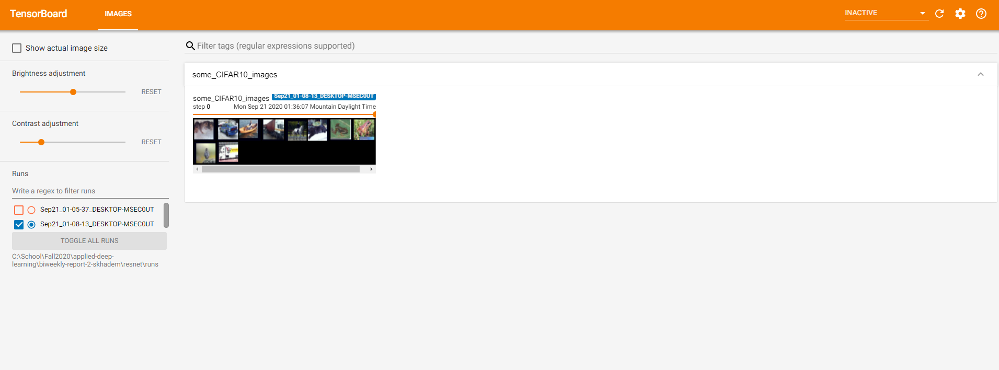
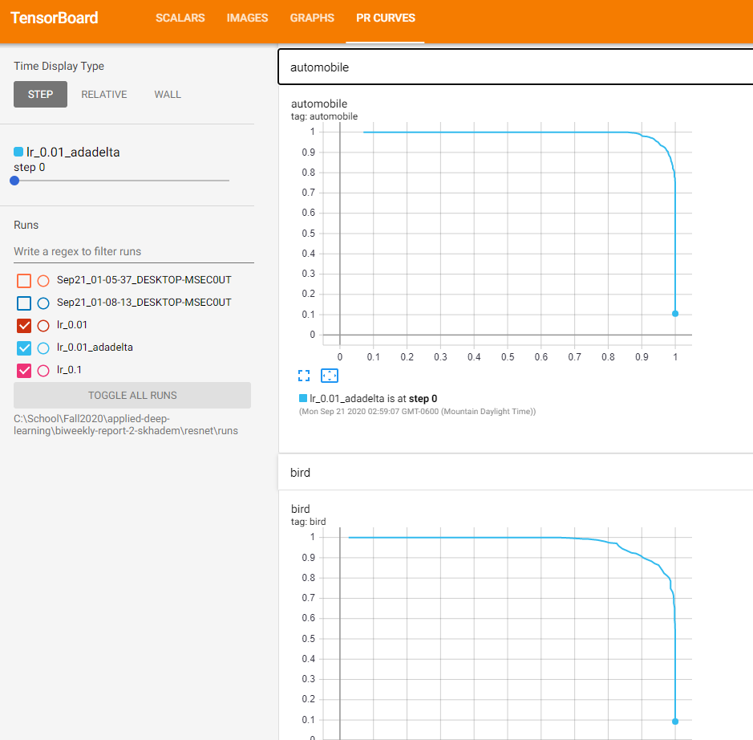

# Using Tensorboard
While training, it is critical to be able to understand what your networks are doing. Some of the aspects that go into training, such as designing the architecture, visualizing inputs, and monitoring training progress, are extremely hard to do simply within a code environment. These require another tool. Tensorboard is the perfect tool, and brings all these things together. The main parts that I investigated are broken down below.

## Graph View
One of the most important parts of deep learning is the architecture. Especially when trying to recreate the results of a paper, the smallest change in the design can have drastic results on the accuracy. And, if implementing a complex architecture by using reusable modules, it can be very hard to see what your model looks like by just looking at the code. Looking at a graph view of your model makes it much easier to see what is happening, In tensorboard, this is as easy as calling `SummaryWriter.add_graph(model)`. This is what my ResNet model looks like:

Clicking any node opens it up for more details:

## Scalars
The most valuable data to write to tensorboard is scalars over time. This can be anything from training loss, validation loss, accuracy, or run time. By assigning different labels when writing the scalar, different plots are used. Different "runs" (i.e. instances of `SummaryWriter`) are plotted on the same plot. This is incredibly useful. I have used this in the past to do hyper parameter searches: by encoding the parameter into the name of the run, all of the combinations can be plotted together, and then after the fact, the best combination can be chose. In fact, while doing these experiments, I was able to catch my own typo! I wanted to try a learning rate of 0.02, so I setup the tensorboard and training loop, and hit start. Because the graphs update live, I saw the loss starting to shoot up after a few batches. I looked at the code, and realized I had put in 0.2 instead of 0.02! Thus, I was able to stop the training early and correct the value. Without these live updates, I would have had to wait until the end of the loop to see that I had made a mistake, or try and squint at print statements that are streaming by. Here is an example of a two different learning rates, and a different optimizer visualized together (note that there is a log y scale):

## Images
This is a way to add parts of the training or validation set to the dashboard. Although slower than doing something simply like `plt.imshow()`, this can be a good way to keep everything in one place, and in a more permanent way. In addition, this allows for you to play with various transformations and see what it would look like in real time.

## Precision-Recall Curves
One way to judge the performance of a model on a per-class basis is by looking at the PR curve. In industry, there are times when high precision can be preferred, and other times when high recall. By examining these curves, the model is better characterized. These also live on tensorboard, and are easy to create:

