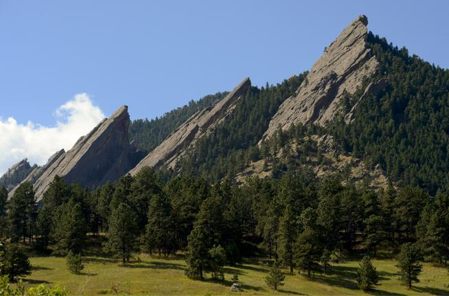

# Neural Style Transfer
Style transfer is the idea of taking the style from one image, and applying it to the content of another image, without altering the content. See example below:

This task has been difficult to do in the past due to the lack of semantic understanding of what is in the image. (i.e. different objects within the image, borders between different functional areas). Due to the ability of CNNs to represent images in a higher level feature space, they can be leveraged to use on tasks like style transfer. Although at a surface it seems the only purpose of this is to produce cool looking images, it can actually provide a glimpse into the representations that CNNs learn, and can provide insight into how they work.

## Running an Example Locally
I copied code from a tensorflow example, just to try it out, and generated this cool rendition of the flatirons in the style of Van Gogh's "Starry Night":

# +

# =

This makes me even more excited to dive deeper into the architecure of this model, and the math behind how this works.

## References
- https://www.cv-foundation.org/openaccess/content_cvpr_2016/papers/Gatys_Image_Style_Transfer_CVPR_2016_paper.pdf
- https://www.tensorflow.org/tutorials/generative/style_transfer
- https://colab.research.google.com/github/tensorflow/hub/blob/master/examples/colab/tf2_arbitrary_image_stylization.ipynb