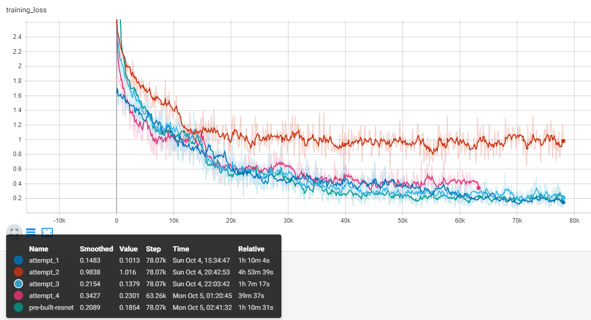
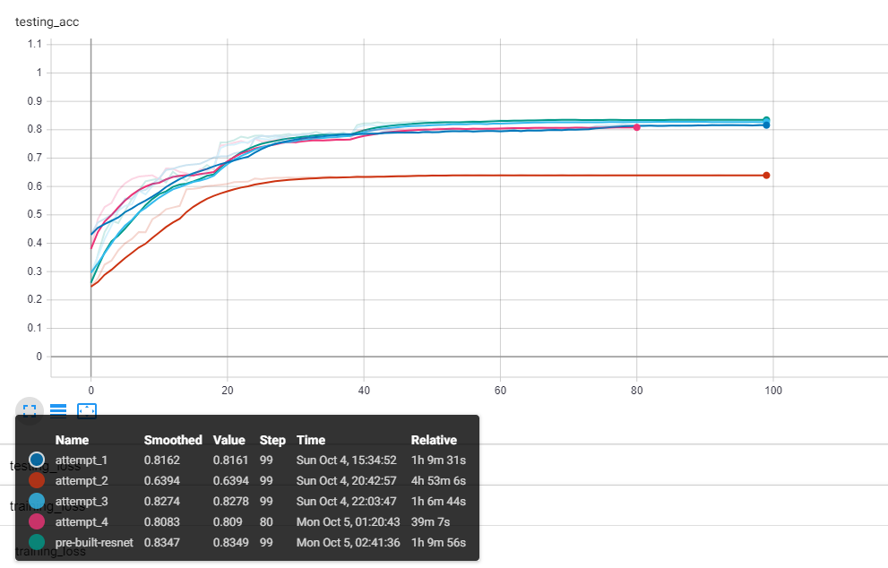
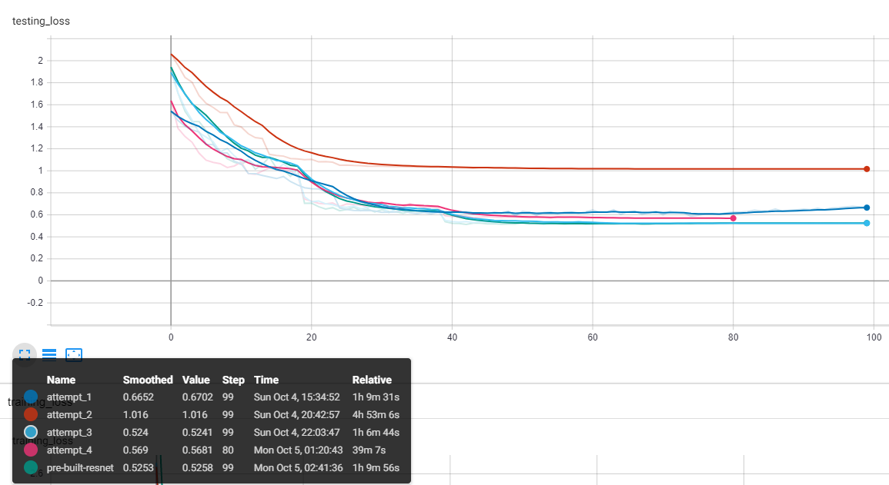

# More work with ResNet
Last time, I coded ResNet from scratch, but for some reason could only get to 50% accuracy on the test set. I spent some time investigating why the performance was so bad, and trying to correct it.

- The first thing I noticed is that I only trained for 10 epochs, but most examples I have seen train for a few hundred epochs. This means the learning rate decay never even kicked in. In addition, I never saw the test loss increase so my guess is that the model was not overfitting. I decided to let the model run for a bit and train for 100 epochs.
    - After letting the model train for much longer, I saw continuous decreases in the loss, showing that the reason for the low accuracy before was simply not training enough
    - I played around with two different hyperparameters: weight decay and different learning rate decay milestones. I found that the higher weight decay works better and that having multiple decay steps also works better
    - This got me to a 82% accuracy in test data
- Then, I read the paper more carefully and realized the architecture I was using was the one for ImageNet! There are some differences for the CIFAR-10 testing done in the paper, so I tweaked the architecture to match this. Notably, there was no deepening, so the block type should be changed to a simple block instead of a bottleneck.
    - After tweaking the architecture to match, the accuracy still remained near 80%, so I am no closer to achieving the same results as the paper
- As a sanity check to make sure my code surrounding the model (training process, test accuracy calculation, etc.) is working properly, I used a ResNet implementation that comes with PyTorch (in torch.hub). I ran the same code on this model, and got 83% test accuracy. So, the problem is most likely in the optimizer / hyperparams relating to learning rate.
- Because my accuracy matches the pytorch official model's, I am confident that given more time to tune hyper parameters, I would get better accuracy.

Some images from the process:

