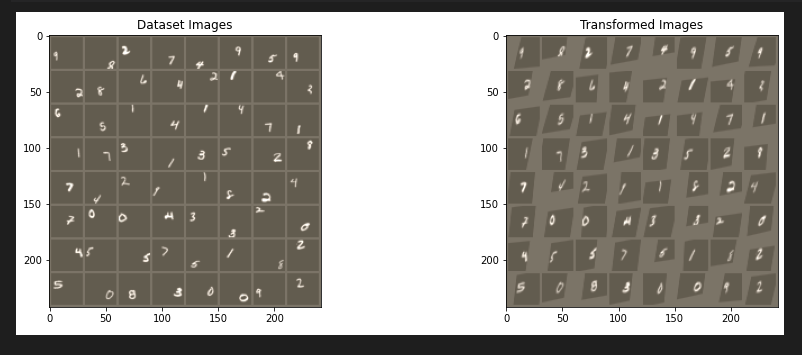
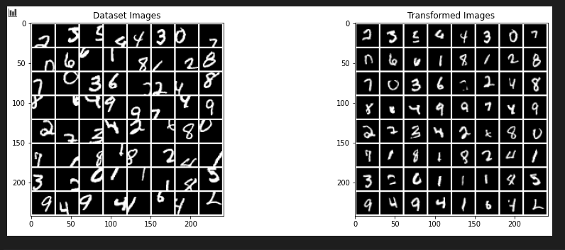
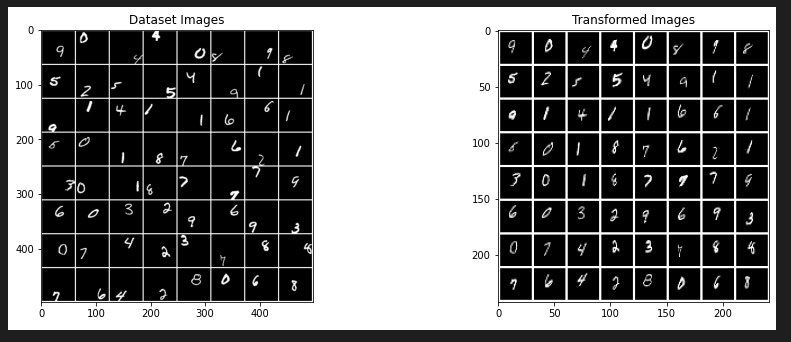
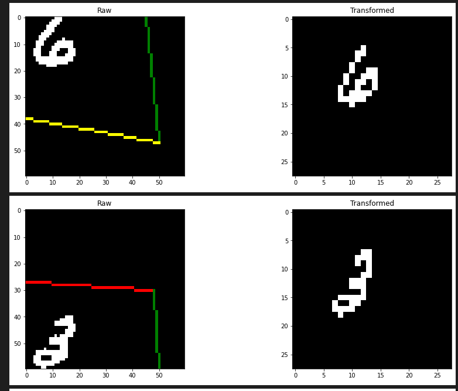

# Spatial Transformer Networks

- In-depth notes about the paper can be found [here](./notes-on-paper.md)
- Some experiments can be found [here](./stn.ipynb) and [here](./stn_downsample.ipynb)

I was so fascinated by how spatial transformer networks work, so I wanted to delve deeper into this network by reading the full paper and then trying to implement a network using spatial transformers (or follow an example implementation). This way, I could really understand how the module works on a deeper level. The visualizations provided [here](https://drive.google.com/file/d/0B1nQa_sA3W2iN3RQLXVFRkNXN0k/view) were so cool to me, that I wanted to try and recreate them. However, I only tried using a simple transform like an affine one, as it failed to rotate MNIST digits correctly (see experiments notebook). I also spent time learning how to use PIL. I am very comfortable in opencv, but I wanted to gain experience with PIL since it seems to be more natively supported in PyTorch.

For the next report, I want to investigate using a different transform method, such as thin plate spline. I also really want to try doing parallel transformers for fine-grained classification, and try to recreate the visualizations on the bird dataset.

## Some notes about my process and results (since the notebooks ended up being a little messy)

- Following the example exactly, the accuracy got to be very good (99%)
    - But, the digits from MNIST were not modified in any way, making the task easy
- Next, I introduced some random shifts to the data
    - The theta learned did not generalize to this data, so I retrained the model
    - The model got up to 93% accuracy!
    - The visualization actually looks good, it is clear the digits are centered (note the image is normalized, which is why there are two different shades of grey):

    

    - But, this was going from 28x28 images back to 28x28 images, making it hard to visualize exactly what the network was paying attention to
- Then, I tried adding random rotations
    - Again, since I was curious to see if the learned localization net generalized to a new type of noise, I tried visualizing the transforms, and it didn't seem to work
    - So, I retrained. Although I got up to 95% accuracy, the digits did not get rotated upright
    - Some guesses as to why:
        - Did not train long enough
        - *Too much* random noise, causing the digits rotation to not matter
        - Since a CNN was used, the inherit model was able to generalize, without need for the ST module
- Next, I wanted to try using the ST module to down sample the image, i.e. extract a smaller section of the image
    - Note: switched over to [this](./stn_downsample.ipynb) notebook for this
    - The modifications were easy: changed the data loader to resize the image to 60x60, changed the localization net to output a 28x28
    - This did notwork great at first
    - My first idea was that because the data was being normalized, there was some information in the blank areas (note that this is why they are a different shade of grey above). So, I tried to use the non normalized images. First on the same setup as before, the 28x28 -> 28x28:
    
    

    - This worked well! But, it did not generalize to the larger case. I kept getting a collapse after a few epochs. The test accuracy would get stuck at 11%, and the transform was extracting blank areas of the image
    - I decided to try using learning rate decay. After some tweaks to the epochs and decay value, it worked!

    

    - This felt **really** good, since I spent hours trying to debug why it wasn't working, and when it clicked that the learning rate was probably sending it into a degenerative minimum, it was *obvious* that learning rate decay would work. It felt like I actually have some intuition about deep learning, since I was able to reason about the correct steps to take rather than randomly tuning hyper paramaters.

- Next, in the same notebook, I dug into visualizing the bounding boxes by using some torch functionality. I spent a lot of time trying this, (as seen in the [first](./stn.ipynb) notebook (near the bottom)). Finally it was this line in the [documentation](https://pytorch.org/docs/stable/nn.functional.html#torch.nn.functional.grid_sample) that saved me:

    > For each output location `output[n, :, h, w]`, the size-2 vector `grid[n, h, w]` specifies input pixel locations x and y, which are used to interpolate the output value `output[n, :, h, w]`

    - While I had been trying to solve everything by hand, I realized that torch does this for me built-in! Finally, I had a start on the visualizations I want to try and recreate:

    

- Next steps:
    - Try to get rotation working
    - Try cropping to smaller, so that it can be a tight bbox on the digit
    - Try and recreate some of [these](https://drive.google.com/file/d/0B1nQa_sA3W2iN3RQLXVFRkNXN0k/view)