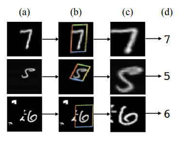
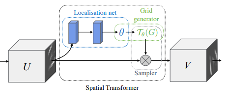
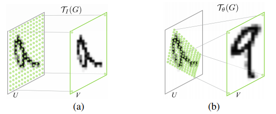
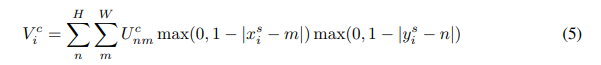
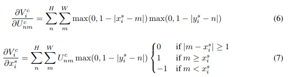

# Notes on the Paper
(Also includes notes from the in-class lecture presented about the paper).
## [Spacial Transformer Networks](https://papers.nips.cc/paper/5854-spatial-transformer-networks.pdf)

### Introduction
- CNNs are limited by the fact the max-pooling is typically restricted to a small spatial area (ex: 2x2).
- This causes the CNN to not actually be invariant to large transformations in the input data
- The *Spatial Transformer* is simply a module that can be included into any neural net architecture, and learns its behaviors in an unsupervised way, making it an ideal candidate to improve robustness of CNNs in practical applications
- The transformer is dynamic, and can spatially transform either the image or the feature map by producing a transform for each sample
    - This includes scaling, cropping, rotating, and non rigid deformations (i.e. an affine transform)
- Because the transform is preformed on the entire image, this allows networks to select the most relevant region (attention) and transform the region to a canonical pose to simplify inference
    - This means that the model itself doesn't have to generalize to inputs in any configuration (which is hard)
- In addition, the transformer works with back-propogation, so they can fit in an end-to-end training of the model without much modification
- There are various key uses where this module can provide significant improvement:
    - Classification when the class is not the focus of the image
    - Localization of a specific class within an image
    - Attention mechanism allows for lower resolution images to be passed into the model, so making the computation more effecient

For example, in the following figure, digits of MNIST are "extracted" from various different places and orientations in the image.

### The Spatial Transformer

- Basics:
    - Differentiable module that applies a transformation to a feature map on a single forward pass
    - The transformation is a function of the input data
    - Note that the same transform is applied to every channel, so the multichannel case acts in the same way
    - Only single transforms are considered for simplicity, but it is easy to generalize to many transforms
- Three components:
    1. Localization network, that takes in the input features, uses a few hidden layers to output the parameters of the transform (namely the coefficients of a affine transform matrix)
    2. Grid sampler, which is used to create a grid of points from which the input map should be transformed
    3. Sampler, does the actual transformation given the parameters and the grid of points to use

### Localization Network
The paper states that any form can be taken for the localization network (such as FC or Conv), but the final regression layer should output $\Theta$, the parameters of the transformation (6 in the case of an affine)

### Parameterized Sampling Grid
Each output pixel is computed using a sampling kernel centered on a location in the input. Here the height and width of the output are determined by the grid. (This height and width will be transformed back to the input feature map height and width by the transformation). This image does a good job of showing this:

Any sort of transformation can be used, but it is important that the loss w.r.t. the parameters can be calculated, since this allows for backpropagation. This is the focus of the next part of the paper, finding the equations for backpropagation of the bilinear transform performed.

### Differentiable Image Sampling
The paper uses a bilinear sampling, defined as:

Taking some derivatives with respect to the input results in:

Now, the mechanism is in place to define the spacial transformer within our networks.

### Spatial Transformer Networks
Through this point, we have a module that can learn attention within an input feature map. The next step is to introduce this module into an existing network, to boost performance of the network on harder tasks, such as cluttered MNIST or street view house numbers (SVHN). The weights of the localization network can be propagated through the network, since it represents the pose of the region or the object. In addition, the transformer can be used to downsample an input, if a different height and width are specified. Multiple spatial transformers can also be placed in the same CNN. This allows for transformations of deeper areas of the network, or more abstract features. Multiple transformers can also be used in parallel, which can be useful to detect and classify multiple objects in the same image. The limitation here is that the number of objects is limited by the number of parallel transformers in the network.

### Experiments
The authors detail a number of different experiments, where networks with embedded spatial transformers perform better than SOA networks.

- Distorted MNIST
    - This dataset consists of MNIST, but with clutter added. The authors investigate rotation, rotiation + scale + translation, projective transforms, and elastic warping
    - Used 60x60 images 
    - For the rotation distortion, the authors elected to use an affine transform, while for the other forms they used a thin plate spline transform
    - Here, the transform comes right after the input, so it is the first layer to see the data
    - What is interesting is that the accuracy achieved with a simple CNN (0.8%) is the same as the accuracy achieved using a spatial transformer with a fully connected layer, showing that the spatial transform is an alternative to CNNs to achieve spatial invariance to the input
    - Note that with clutter, (i.e. random noise) the ST networks achieve much higher accuracy than the traditional FC or CNN networks
- SVHN
    - This dataset is really challenging: it is taken from street view images, and contains tiny digits (yes, plural now!) within the image. 
    - The output architecture is a CNN with 11 hidden layers, and 5 independent softmax classifiers, with each one leading to the value of the digit in that position. A class is used for null, so that the length of number can be anywhere from 0-5
    - There is a spatial transformer right after the input, as well as 4 other spatial transformers within the network, providing some transformation of the deeper feature maps
    - Note that the parameters of the transformer are initialized to be the identity matrix
    - Achieves state of the art on 128x128 images, requiring only a single forward pass, whereas other models require multiple forward passes and Monte Carlo averaging - making the ST models preferable for their simplicity and end-to-end containment
- Fine grained bird classification (my favorite example)
    - Dataset: CUB-200-2011 birds dataset - 200 species of birds, with the images containing the bird at many different angles, sizes, locations in the image
    - Other methods require complicated algorithms to extract the portion of the image that is the bird. ST requires only the training labels!
    - Used an Inception CNN with batch norm as base model. Added 2/4 parallel spatial transformers, which act on the input image. The outputs are passed to separate sub nets that are concatenated and classified with a single softmax layer
    - It is super fascinating to see that each transformer learned a different part of the bird. Ex: red learned the head, green learned to find the body:

