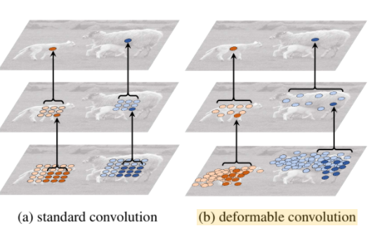
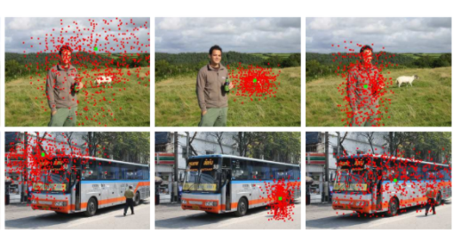
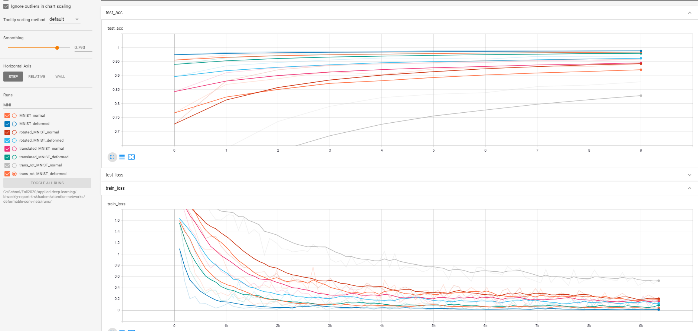
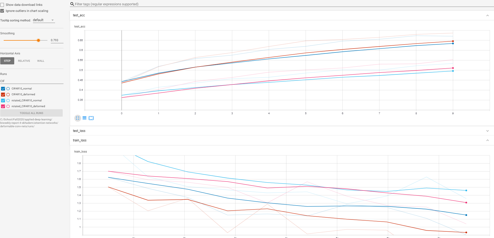

# [Deformable Convolution Nets](https://openaccess.thecvf.com/content_ICCV_2017/papers/Dai_Deformable_Convolutional_Networks_ICCV_2017_paper.pdf)

```
Note: I spent a lot of time reading and making comments on this paper. I found it was easiest to do this on Google Drive with the built-in commenting feature. I made the document open to anyone with the link, it can be found in the link below. Thus, only a short summary is put here and more in-depth notes are on the pdf itself
```
[Link to Google Drive PDF with my comments and questions](https://drive.google.com/file/d/1Avv9WkuYRpLbPe8fM11YnHiQqtZ_5j03/view?usp=sharing)

This paper provides a brand-new way to look at convolutions. It introduces the idea of _deformable_ convolutions. The intuition here is that normal convolutions are constrained to a grid that slides over an entire image. Thus, conforming to different positioned objects requires creating a deep net that can learn to be invariant to the change in the object within the image. A more intuitive approach is to allow each point of the kernel of the convolution to generalize to be able to be translated to anywhere in the image. This is done by adding an extra conv block to each normal conv that learns offsets for the kernel points. This results in an output dimension of `2*kernel_height*kernel_width` (2 for x and y positions). The paper also introduces deformable ROI pooling, which is used for object detection. I spent less time on this, and mostly focused on the deformed convolution. The below two images show the idea behind this:





This second visualization was fascinating to me, and I really wanted to recreate it. I trained a few toy networks on MNIST, but couldn't quite figure out how the output of the offset network should be used. Since this module is a really new feature to `torchvision` (Dec 2019), there is little documentation / examples. I read through the cpp implementation, and it was very useful to get a start into using the offset, but I never finished this work. I plan to do it next.

I also wanted to run some experiments comparing the performance of deformed conovolutions with regular ones on more challenging datasets (MNIST and CIFAR) with added rotation/translation. The below table summarizes this, and the tensorboard screenshots also show it.

| Model         | Baseline MNIST | MNIST rotated | MNIST translated | MNIST rotated and translated | CIFAR baseline | CIFAR rotated |
|---------------|----------------|---------------|------------------|------------------------------|----------------|---------------|
| Regular Conv  | 98.82%         | 95.78%        | 95.71%           | 87.28%                       | 67.36%         | 53.01%        |
| Deformed Conv | 99.1%          | 98.27%        | 98.27%           | 94.03%                       | 68.52%         | 55.16%        |
|               |                |               |                  |                              |                |               |

Note that I didn't spend the time to tweak params to optimize for CIFAR. This was meant as a quick experiment to compare the two convs side by side. The deformed version consistently outperformed the normal conv, most notably when there was both random rotation and translation present. 






## More Resources
- https://medium.com/@phelixlau/notes-on-deformable-convolutional-networks-baaabbc11cf3
- https://towardsdatascience.com/review-dcn-deformable-convolutional-networks-2nd-runner-up-in-2017-coco-detection-object-14e488efce44