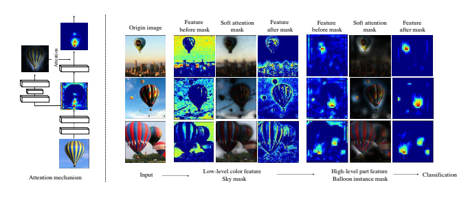

# [Residual Attention Netowork](https://openaccess.thecvf.com/content_cvpr_2017/papers/Wang_Residual_Attention_Network_CVPR_2017_paper.pdf)

```
Note: I spent a lot of time reading and making comments on this paper. I found it was easiest to do this on Google Drive with the built-in commenting feature. I made the document open to anyone with the link, it can be found in the link below. Thus, only a short summary is put here and more in-depth notes are on the pdf itself
```
[Link to Google Drive PDF with my comments and questions](https://drive.google.com/file/d/1Ui0Vmx9mmB2NdjIE8b8Dg7aE4WjYIlIy/view?usp=sharing)

This paper provides a way to use residual connections to stacked attention modules in order to create a soft mask on the features. The paper achieves really good results, by getting similar performance to the top ResNet models with nearly half the FLOPS, by going less deep. This paper also spent some time showing that using this architecture, the model can be robust to noisy labels. It was interesting to me that they spent time on this, since it seems to not be something that is necessarily a worry of most models, the labels are generally treated as ground truth. A key takeaway from this paper is that they used what they call "mixed" attention, which dynamically learns weather to focus on the channel dimension or the spatial dimension. The basic structure is a trunk branch and a mask branch. The trunk branch is a typical ResNet-like deep conv net. The mask branch consists of the attention modules, which have an encoder-decoder structure. The outputs of these are multiplied by the features at various points, to mask out some and put emphasis on others.

I would love to recreate some of these visuals:



There aren't many simple implementations of this network so it will take a much deeper dive and more time to do this.
