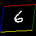

# Spatial Transformer Networks

I continued work from last time to get more visualizations of STN working. I am happy with the translation, and more happy with rotation, even though it's not fully there. (Especially the generated example below). I believe I need to do something other than bilinear interpolation to get this to work. Not that nothing was changed from last time other than training longer! I was stopping early because there seemed to be no improvements, but by just letting it run, the improvements came.

