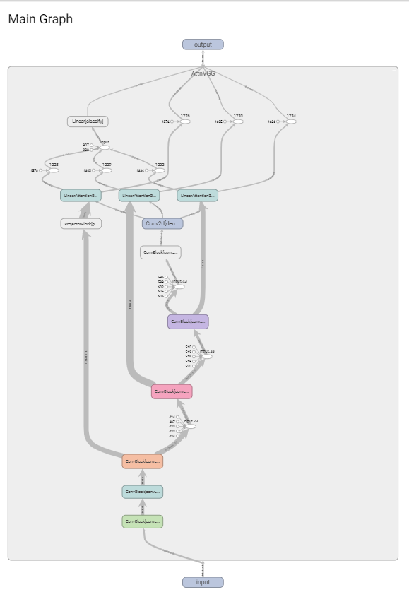
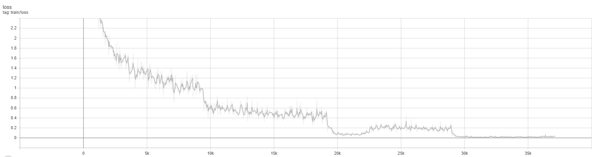
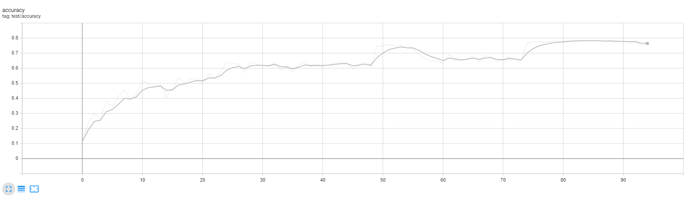
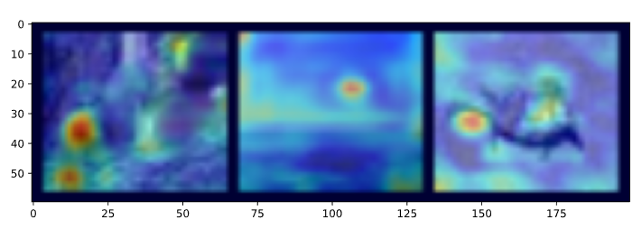
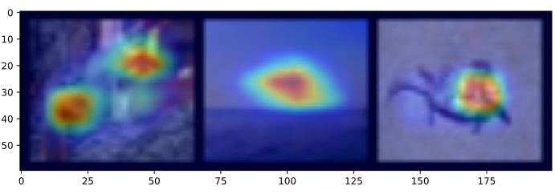
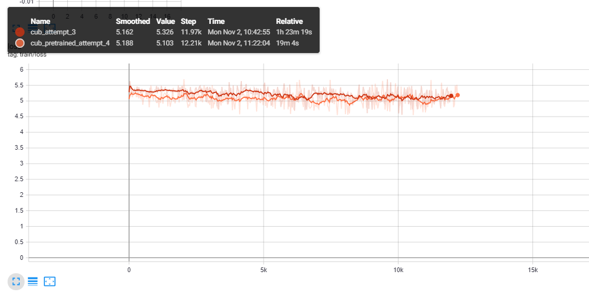

# Experiments with Learn to Pay Attention
The best way to learn how a networkworks is by writing the code for it, training it, and then visualizing it. I decided to adapt the code from an existing repo on GitHub in PyTorch to explore how this network works. I first wrote the code to setup the network, and it actually helped clarify a lot about how things are connected and how each piece fits in together. For example, the attention block that involved an inner product with weights was sort of confusing to me, until I realized that it can just be implemented as special sort of convolution. Implementing the `forward` function also solidified the idea that the attention happens with the last layer, since the final features are required to be combined with the intermediate results.

## Model

As is clear, the outpupt is a combination of the attention blocks, which take in deep feature maps from the earlier layers as well as the final feature layer.

## CIFAR-100
- [CIFAR 100 notebook](./learn-to-pay-attention.ipynb)

I first ran training on CIFAR-100 to see if I could reproduce the results from the paper. The paper reported a top-1 error of 22%. Below are the results from my training

Training Loss:

Test accuracy:

The test accuracy peaked at around 80% top-1 accuracy, which is pretty good for a first attempt without any hyperparameter tuning. This also seems to beat the paper! The training loss got very close to 0, which means that the network is overfitting slightly, and not generalizing too well. Next time I would like to try adding some dropout to try and combat this. Due to the size of the dataset and the difficulty of the task, I let my machine run all night, which means that it is hard to run many different experiments. I next wanted to visualize the attention learned at the three different attention locations within the network.

## Visualizing Attention
The visualizations are pretty cool. Each different attention block contributes differently. The first one in almost all of the examples I tried was 0 everywhere, which is sort of weird, but I didn't have time to dig into why.

Here, the model correctly predicted the classes. (it's hard to see but the first image is a squirrel, the second is a beach and the last is a crab). The second and third attention blocks, respectively, show different parts of each image being focused on.

## CUB-2011 (Fine-Grained Bird Classification)
- [CUB 2011 notebook](./learn-to-pay-attention-cub.ipynb)

I have never tried a fine-grain classification task, since they always seem really hard. I found out this is true! The differences are so slight, so it makes sense why these tasks are extremely difficult. I really liked how the paper had the example of attention on CUB-2011, showing that **different attention blocks tend to focus on the same types of features**. I.e., one of the blocks consistantlye looked at beaks, one looked at wings, etc. I *really* want to recreate these, but failed. Next time, I will, focus on this task.

The first blocker I ran into was the data itself. The images are much larger than the CIFAR ones, so the first issue is how to deal with these sizes. Initally, I tried resizing them to 224x224 (the default VGG size), but these images are so big that I could only do a batch size of 2. This clearly wasn't going to work. So, I tried a size of 128x128, with a batch size of 8. After running for about an hour I realized this also was not converging. Looking at the paper again, I realized that they had used a pre-trained model that was fine-tuned on CUB-2011. So, I tried to use the model I had trained on CIFAR-100. Since the size is again different, there needs to be something done to match to the 32x32 input I had changed. What would make sense is too add some conv and batch norm layers in order to get the dimensions to match, but I decided to try the simpler approach of simply reshaping the image. This also did not work. In addition, I loaded all layers excpet for the classification ones, but I wonder if the attention layers should also not be transferrred. Next time, I want to try resizing correctly, and tranferring a different number of layers. Images of the failure:

# Resources
- https://arxiv.org/pdf/1804.02391.pdf
- https://github.com/SaoYan/LearnToPayAttention
- https://pytorch.org/tutorials/beginner/finetuning_torchvision_models_tutorial.html