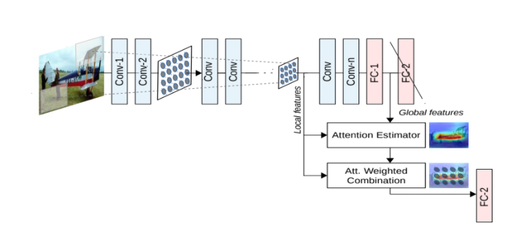
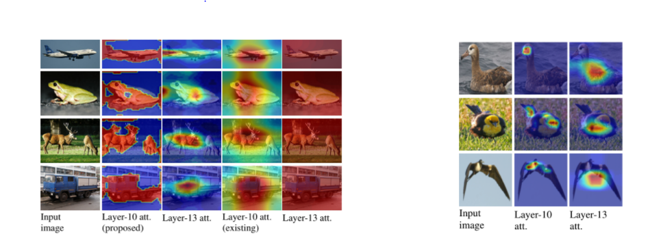

# [Learn To Pay Attention](https://arxiv.org/pdf/1804.02391.pdf)
This paper caught my eye, as it was mentioned by a few other papers as foundational work for the field of attention networks. As before, I annotated the paper on Google Drive [here](https://drive.google.com/file/d/1TRhsDf49GaSD87txaIRqAU0gPkz2ZQju/view?usp=sharing). I also include some of the main ideas and figures here.

- This paper does a good job of explaining some of the existing attention work, as well as explaining the different categories they fall into
    - Normal attention is done post hoc. This could be seen as a way to analyze the way a network works, or to augment an already trained network. They key idea of these is that they use a fully-trained model to begin with, so things are already nice.
    - Trainable attention is when there are influences of attention during the initial training of the model, so the attention plays a part in setting up the model and getting initial accuracies. Within this category there are two types of attention.
        - Hard attention (essentially a crop) is when a hard decision is made on which region to use. The downside to this is that the function to make the hard decision is not differentiable, so there is no way to run back-propogation, and thus optimizing them is harder
        - Soft attention (the category this work fall sunder) essentially just adds a weight to parts of the feature vectors. This is differentiable, and thus can be done with normal back-propogation.
- The appliciations of attention are also numerous. On top of performing better on the classification task, (**This paper reports 6% improvement in CIFAR-100**) there are a few other applications of attention:
    - Domain shift, i.e. improving the generalization capability of the network, so that it performs better on new data
    - Weakly supervised semantic segmentation, or finding pixel mappings of objects using only the image labels
    - Adversarial robustness. This one was new for me, but the authors claim that part of the reason adversarial attacks are possible is because the model uses parts of the image that are unrelated to the object in question. Thus, attention can help the network ignore these parts of the image.
- Some of the key ideas of this paper lie in the difference between *local* features and *global* features. *Global* features are the representation of the whole image, their receptive fields cover the whole image. Thus, they come at the end of a network, and are typically passed straight into a fully connected layer that then predicts the class. *Local* features are feature vectors that come from parts of the network earlier on, and are a subset of the image.
- The proposed architecure uses attention maps applied to the local features in order to make a prediction. The intuition behind this is that the lower resolution features should influence the final output, but weighted to the amount of attention the network should give to them.
- The attention mechanism comes from a comparison function that outputs a set of weights to apply to each spatial location of local feature map
    - This function looks at the feature map at a spatial location and the global feature map
        - The intuition is that if the local feature map at a spatial location is similar to the global feature, then it should influence the the outcome more. 
    - Note that these scores also go through a softmax function, causing them to compete with each other, as well as form a valid probabilistic view of the attention.
    - The authors propose a weighted inner product (where the weights are learned) and a normal dot product to use for this function
- **The resulting weighted combination of local features then replaces the global feature map in the final classification step**
- Note that this can thus be dropped into any architectue, and all that changes is the final prediction steps
- Below shows the basic idea of the model:

- Here are some results on CIFAR-100, as well as the popular CUB-200 fine-grain classification dataset:

