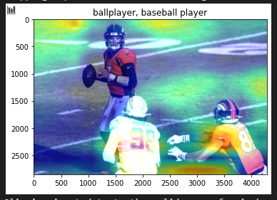
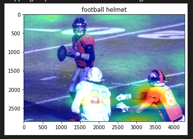

# Class Activation Maps
Note that CAM only works for models where there is a feature map right before a softmax. This greatly limits the type of networks that can be visualized, so it is a shortcoming of the method. Grad-CAM intends to solve these problems, and it does. It can be applied to any type of network, and, in addition, to any type of task. The paper shows Grad-CAM working on tasks such as image captioning and visual question answering. Recently, I learned that a huge shortcoming in this field is that the multimodal datasets are easily generalizable, and this causes the models to not even look at the images. For example, the most typical answer to "how many ______ are in an image", is 2, so the model usually guesses this. Thus, looking at a CAM can inspire a lot of confidence that the model is actually doing the right thing. 

## Experiments with CAM
Some cool results that came out of the experiments I ran: in the notebook that I worked through, I included an example of Broncos players, hoping the network would pick up the "Football Helmet" class. Instead, the top predicted class was "Baseball player". Looking at the CAM visualization, the model was focused on the grass, showing that this could possibly be an example of the model learning that the images with baseball players are typically on grass, so the model learned to generalize these images, and not actually learn the class present. I also tried to use the index for football helmet to see if the model would focus on the right part, but a similar result occurred:

The notebook can be found [here](./grad-cam-pytorch.ipynb)

## Resources:
- https://arxiv.org/pdf/1610.02391.pdf
- https://towardsdatascience.com/demystifying-convolutional-neural-networks-using-gradcam-554a85dd4e48
- https://medium.com/@stepanulyanin/implementing-grad-cam-in-pytorch-ea0937c31e82