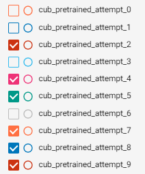
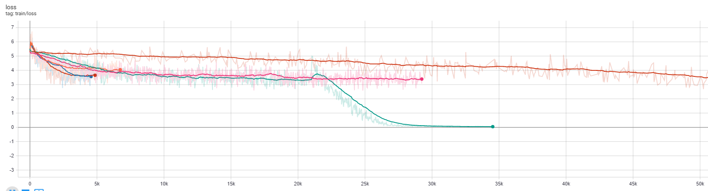
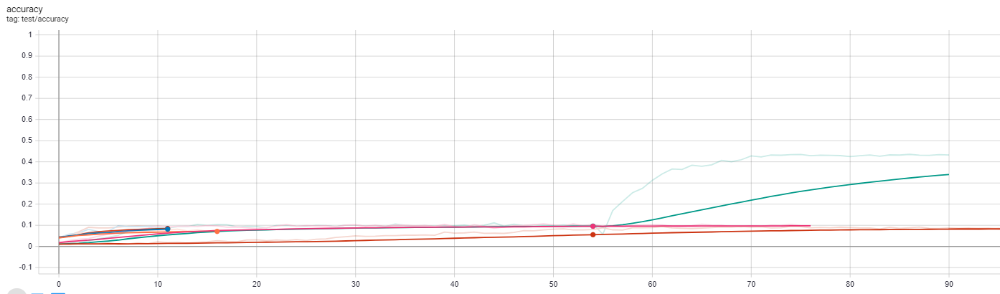
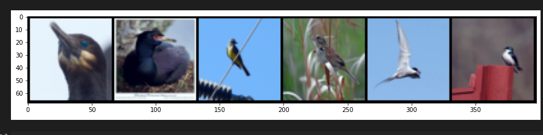
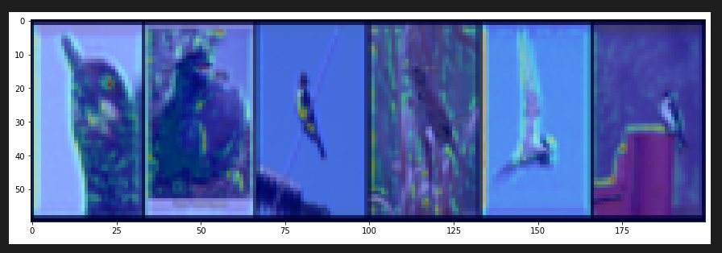
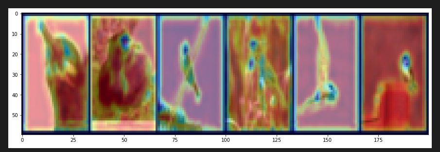
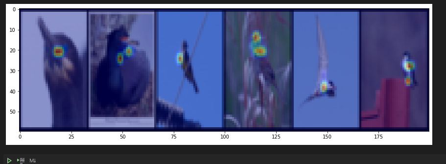

# Learn to Pay Attention (part 2)
Last time, I only began training on the CUB dataset towards the end of the report, which meant that I didn't have time to fully explore trying to get a model to converge for the task of fine grained classification on the CUB-2011 bird dataset. At the very end, I realized that transfer learning was key to accomplishing this task, so I decided to rush and try it. My first problem was that the dimensions of the input images were potentially different, and I did not know how to deal with that. Becuase it was late, I failed to realize that the weights of the conv layers do *not* depend on the input size. A fact that is so integral to CNNs, but that I forgot. 

This time, I started by loading in the weights of from the attention net I had trained on CIFAR-100. I only loaded in weights for the convolutional layers, so that I could tune the attention layers and the final classification layer. I ran a few experiments, modifying various hyperparameters, but never got really good results. Learning from my mistakes, I didn't stop early, and let the training run for a while. Although eventually improving in accuracy a bit, the improvement was not encouraging. 

## Results of Experiments
First, I allowed the gradient to flow through all of the pretrained layers, that is, I tuned all of the layers, even the convolutional ones. Although this model converged very slowly, it continued to converge until around epoch 80. Then, the test accuracy stayed exactly the same while the train accuracy continued to rise. This is puzzling to me, since usually if a model overfits, the train accuracy starts to decrease. Here, the test accuracy stayed almost exactly the same.

Then, I "froze" all of the transferred layers. That is, I set `allow_gradients` to `False` in PyTorch, which locks in the values of those layers. This is how fine-tuning is done in practice, so I was hopeful. Although the initial rise in accuracy was higher than the first attempt, both the training accuracy and test accuracy got "stuck" around the 18th epoch, much sooner than when I allowed all layers to be trained.

At this point, I decided to work on other parts of the report. Sometime later, I decided to come back to these ideas, and decided to start by letting the models run for longer. First, I resumed the training of the fully tuned model, which had seemed like it was overfitting. Sure enough, the test accuracy continued to rise, and the test accuracy began to _slowly_ decrease, which was much more in line with what I expect to see in the plots. Next, I loaded one of the models where I had frozen the conv layers, and resumed training. This is when something crazy happened. *I forgot to run the cell that freezes the layers, BUT, training started to go _really_ well*. I was shocked. The training accuracy approached 100%, the loss decreased at an expected rate, and the test accuracy shot up. See the plots, there is a clear point when things change (after epoch 55):

Legend:

Notes on what each trial was
1. Freeze all pretrained layers - stopped early
2. Didn't freeze any layers, LR decay every 10 epochs. Accuracy is slowly increasing
3. Forgot to check if directory exists, saving epoch 0 failed
4. Freezing all pretrained (conv) layers, LR decay every 25 epochs 
5. Freezing all pretrained layers (conv), LR decay every 15 epochs
    NOTE: After 50 epochs when I resumed training, accidentally did not freeze the layers, so allowed all layers to train. Somehow this worked miracles.
6. Transferring more layers (all but classify/dense), none frozen, LR decay every 15 epochs
7. Transferring more layers (all but classify/dense), freeze all transferred, LR decay: `scheduler = lr_scheduler.MultiStepLR(optimizer, milestones=[30, 50], gamma=0.1)`
8. Same as above but much lower LR decay: `scheduler = lr_scheduler.MultiStepLR(optimizer, milestones=[7, 20, 50], gamma=0.1)`
9. Same as above but even lower LR decay: `scheduler = lr_scheduler.MultiStepLR(optimizer, milestones=[4, 7, 10, 50], gamma=0.1)`

What this means is that my best model (attempt_5, the highest of all the curves) was achieved by freezing some of the layers, training for 50 epochs, and then *unfreezing* all of the layers and continuing training. And, this happened by sheer luck: a mistake in forgetting to run a Jupyter cell before starting to train. I looked to see if there was any work showing that this is a valid approach to transfer learning, but couldn't find anything. This also makes me wonder how many results in deep learning are simply stumbled upon, and then explained after the fact 

## Visualization Using Best Model (attempt_5)
One of the cool results from the paper was that each attention layer learned to consistently focus on different parts of the bird. For example, the paper mentions that layer-10 learns to fixate on the eye and beak regions, while layer-13 focuses on plumage and feet. I wanted to see if I could gain insight into my own model by visualizing some of these activations, to see if a similar pattern was emerging. It seems the first two attention layers are not learning anything useful, but the third layer is picking up on the chest/head plumage, which is cool!

