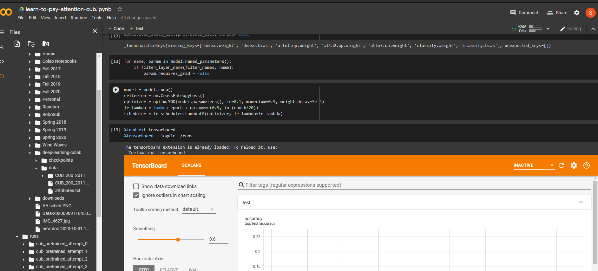
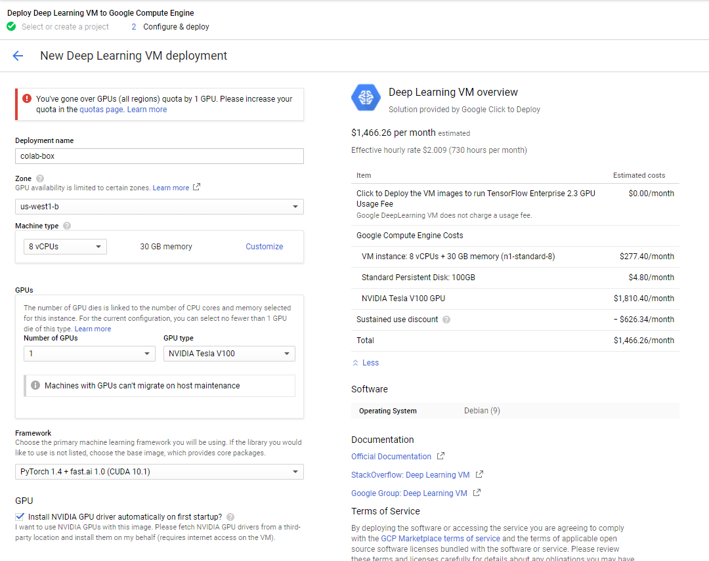

# Cloud Platforms
As I am starting to work with larger datasets, it is become essential to start looking to increase the processing power I am using. I have a 1080Ti GPU which works pretty well, but for datasets like CIFAR-100 or CUB-2011, it begins to limit me. With the CUB-2011 dataset, the details in the images are important, so it is key to work with larger images. This means that the max batch size I can use is limited, which makes it hard to successfully train a model. In addition, the time it takes is increasingly long, so being able to scale the hardware used would help with that. I am also seeing the benifit of running many trials, testing different hyperparameters. With my local computer, I can only run one trial at a time. With a cloud platform, I could launch many different trials at the same time and see the results at the very end.

In order to get a feel for which platform is best to use for what reason, I investigated a few different ones.

# Google Colab
Google colab (short for colaboratory) is a new product from Google Research that is essentially a new way to run notebooks in the browser. It has quickly gained popularity because of its ease of use, and collaborative nature. It is also built into Github, which is pretty cool. Note that the regular Colab has a very limited GPU to use, so it is actually faster to train locally. There is a Pro version fo $9.99/mo, but a more comprehensive approach is to use the extensive Google Cloud platform.

It's pretty cool how integrated it is, for example, here is Tensorboard built right into the notebook:

# Google Cloud
In order to beef up the hardware used, it is necessary to use Google's more enterprise solution, Google cloud. This is a paid platform, but there is a $300 starting trial, which should be enough for limited use for the rest of the semester. 

This platform has so many cloud applications, but the main two for training models is [Compute Engine](./https://cloud.google.com/compute) and the [Deep Learning VM](./https://console.cloud.google.com/marketplace/product/click-to-deploy-images/deeplearning?_ga=2.99839453.-2121832178.1549923708). It is a little confusing to get started, since you have to "enable billing" on a project to get to the right configuration page. It seems that Google organizes things by "project", which makes sense in an enterprise sense, as billing can be done per-project, which makes tracking payments and invoices easier. 

Once enabled, clicking "Launch" on the Deep Learning VM page takes you to a configuration page: 

In order to use GPUS, you have to increase the number of GPUs in your "quota". I'm guessing this is usually set on an administrator-level to limit the cost of an organization or project. Unfortunately, by default the free trial does not default to allowing GPUs. You can submit a request to increase this limit, but for some reason my requests keep getting denied. I think there are extra hoops to jump through for free trials, so I have contacted Google support.

After this step, the next step would be enable port forwarding from my local machine to the VM, and then connecting colab to my "local" machine, which will forward to the VM.

## Resources
- https://www.youtube.com/watch?v=U5HyNzf_ips&vl=en&ab_channel=GoogleCloudPlatform

- https://www.youtube.com/watch?v=kyNbYCHFCSw&ab_channel=GoogleCloudPlatform

# AWS / Azure
These are also popular platforms, but because I am a fan of the Colab environment, I spent my time focused on getting the Google Cloud platform working, and didn't really have time to explore these ones.