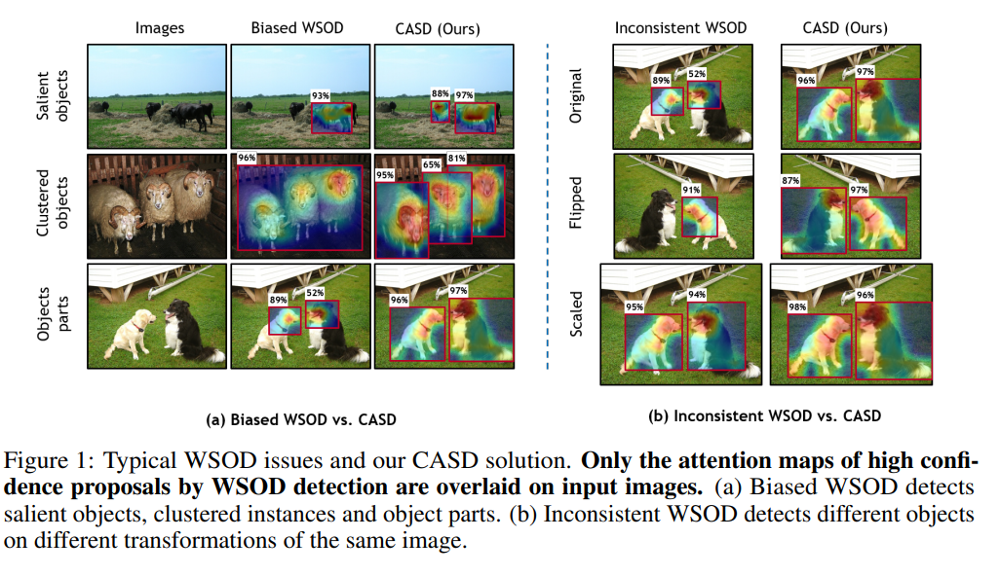
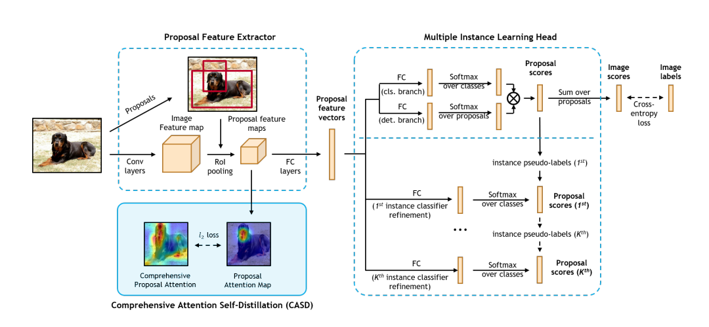
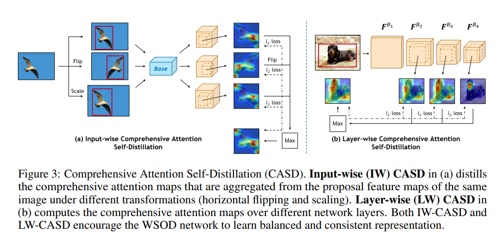
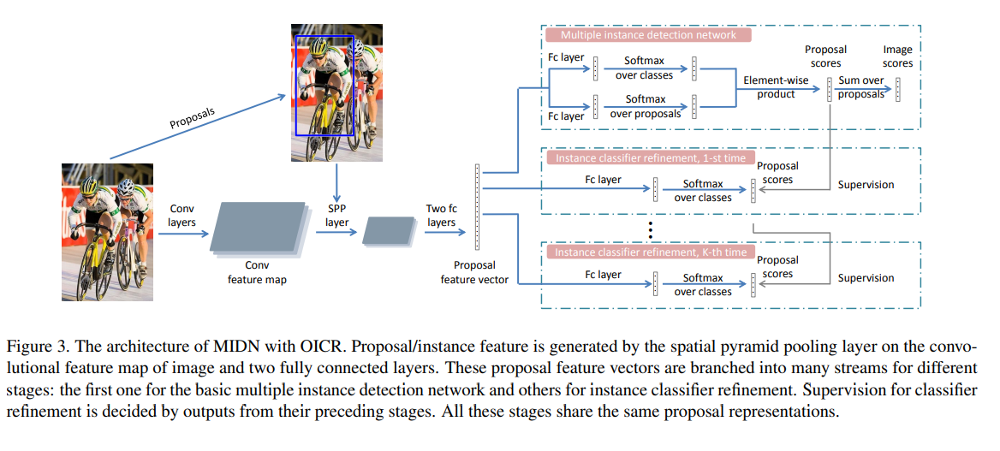
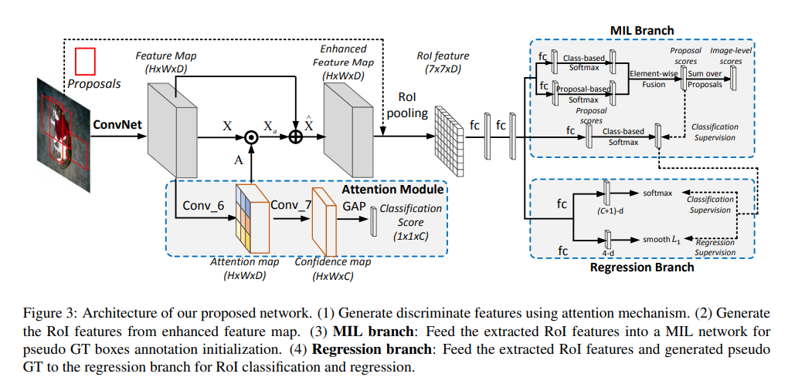
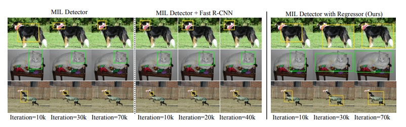

# Using Attention for Weakly Supervised Object Detection (WSOD)

One of the natural ways to perform WSOD is to take advantage of the implicit properties of an attention module. Attention modules are designed to figure out which parts of an image are of significance to the output classification, which can be naturally extended to provide bounding boxes of that region also. There are a few papers I found that seem interesting. This report, I focused on more of the fundamentals of WSOD, in order to get comfortable with some of the basics. I include a brief summary and the main diagram of a few of the attention-based WSOD that I found, and then plan to dive deeper into some of the papers next time.

### [Comprehensive Attention Self-Distillation for Weakly-Supervised Object Detection (CASD)](./https://arxiv.org/pdf/2010.12023v1.pdf)

These authors argue that some of the main shortcomings of current WSOD are that the detector is prone to false positives, missing clusters of objects, and inconsistency across different object positions. CASD computes attention aggregated from multiple feature layers as well as multiple transformations on the same image. In addtion, CASD conducts self-distillation in order to enforce consistent spatial properties. The following figure shoes some of the shortcomings of other methods as well as the success of CASD:

What is important to note is that CASD is a module that that can be added to existing methods such as OICR, such as the example below:

How the CASD module works is really fascinating. Because it can be noticed that different image transformations lead to different attention activations, the module uses these different transformations _as part of the loss_. This is really cool. Each image horizontally flipped and scaled, resulting in 3 augmentations of the same image. All three are passed through the attention module, and the outputs are compared to *each other*. This enforces consistency across different object positions, meaning that the attention is becoming more generalized to the object itself, rather than a specific image. Using the augmented image, each proposed region is cropped from the attention map, amd the union is taken. Note that the translation is undone in order to have all three representations in the original image space. Thus, the combined attention map is used to refine the feature map of the image. This is what is considered to be the knowledge distillation into itself, since the network is essentially tuning itself.

In addition, a similar process is done layer-wise. ROI pooling is done at different feature output positions, causing an output of the same size. Then, layer-wise attention maps are generated from each layer and aggregated to obtain a final activation map.

What is amazing is that each step has its own loss, and the loss is based almost purely on consistency with other image augmentations or different channels of a feature map. The label is only used at the final output. The final loss is a weighted combination of all of the intermediate losses. Below is a diagram showing what image level and layer level modules look like:

### [Online Instance Classifier Refinement (OICR)](./https://arxiv.org/pdf/1704.00138.pdf)

This network is very similar to other methods in the base, but then introduces a refinement head, that is used to improve the detection location. In a nutshell, instance labels are propagated to overlapping instances in order to refine the final choice of bounding box. What this means is that the exact same structure as WSDDN is used to generate class scores for each proposed region. In short, this looks like: proposals + conv features -> SPP -> FC -> FC (classes), FC (regions) -> proposal scores (classes * regions). (See [notes](.wsddn/README.md) on WSDDN for more detail). This proposal score is combined with the softmax output of a "refinement" FC layer. This combinations is passed to the next refinement layer, and the process is repeated iteratively.

### [Towards Precise End-to-end Weakly Supervised Object Detection Network](./https://arxiv.org/pdf/1911.12148v1.pdf)

The main issue that the authors see with current methods is that they tend to converge to local minima, due to the fact that they are two phased. That is, an MIL detector is trained to provide pseudo GT boxes, which are then fed into a typical supervised method, where the bounding box location is regressed. This method trains both parts (MIL and bounding box regression) in an end-to-end fashion, making it more robust to optimization. They use the attention module to produce the final classification score, as well as to augment the feature map. What I found really interesting is the residual connection between the feature map and the "enhanced feature map" (which is te feature map with attention multiplied in). Then, ROI pooling is used to produce multiple region proposals. The authors base this MIL branch on WSDDN. Using the output as psuedo GT, a typical detection network such as Fast R-CNN is trained.

What I find interesting is that the authors claim that the strategy of using MIL to produce an input to a normal bounding box regressor is unstable, and yet they propose almost the same thing! A major difference is the attention module that helps to improve the quality of the feature map representation, which helps. The results obtained are pretty good, these images highlight the fact that their network is able to localize the whole object, rather than a smaller portion of it:

