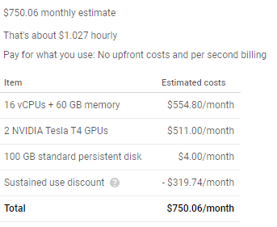
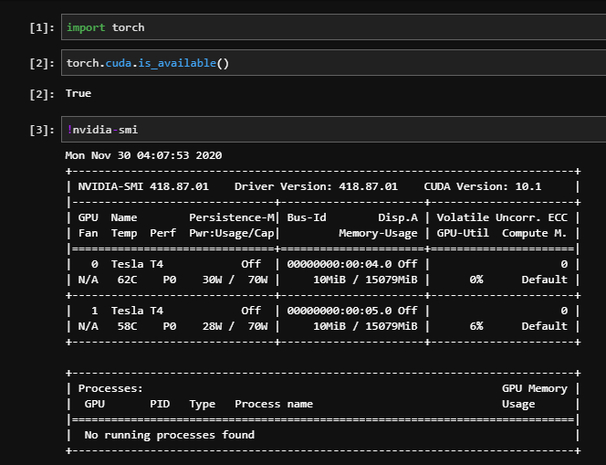

# Google Cloud Platform VM (continued)
Last time, I setup my account and a trial to see if I could try out [Google Cloud Platform](./https://console.cloud.google.com/) (GCP). However, I ran into an issue when configuring a VM, since I had a quota of 0 GPUs (meaning I could not start a VM with a GPU). I was prompted to contact sales in order to increase the quota. I was a little hesitant, since I only wanted a trial and did not think I needed to talk to someone about it, but I decided to send an email anyway. The process was very seamless. I liked that they asked me for a few good times, and they picked one from those options to meet. I had a video meeting with a sales representative, who explained that the reason they make new users have a meeting to gain access to GPUs is because the cost can very easily increase rapidly (past the trial amount). After a quick 15 minute meeting where I explained why I wanted to use GPUs, the Google rep submitted a form to increase my quota. A few days later, I got an email saying my request was approved. The entire process was actually really nice, and the conversation was useful.

Creating the VM itself was very easy. There are a lot of options for combinations of CPUs/Memory/GPU, so I just followed the choices in [this](https://www.youtube.com/watch?v=U5HyNzf_ips&vl=en&ab_channel=GoogleCloudPlatform) video. Here is the cost breakdown:



After I created the VM, a command appeared to find the URL at which a JupyterHub notebook was already created. Just like that, I had some serious horsepower:



The next step for me was to clone my repo (I used JupyterHub's built-in git window), and upload my data. The reason I think this is the way to go is that the VM is billed for the time it is on, so any coding done on the VM costs money. Thus, it makes sense to only use the VM to perform the training. One pain point was that I had launched the VM with some default PyTorch version, which also meant a specific CUDA version. It was really nice that all of that was done for me, so that I didn't have to worry about drivers and all that fun stuff. But, the version was different from my local machine, which meant that some parts of my code didn't work. I had to add a few hacks to get around this.  

Another point (mostly for my own reference) was that accessing browser-based tools (like tensorboard) is not straightforward. Within jupyterhub, the filesystem is under a different user: `jupyter@INSTANCE_NAME`. Google offers a tool called "web preview" from its cloud shell, which allows a port to be viewed from a browser. To get it to work, within the cloud shell, you have to SSH into the `jupyter` user:

```
gcloud compute ssh jupyter@INSTANCE_NAME -- -L PORT:localhost:PORT
```

Then, tensorboard can be launched from the cloud shelll to `PORT`, and it can be viewed in the "web preview".

In the end, I was hoping to see a huge performance gain thanks to the crazy amount of GPUs I was getting. However, since the task I am working on uses minibatches with only one image, the bottleneck is not the forward / backward passes. I would like to train something with larger batches/images (like my CUB attempts from last report) to see truly how much faster it is. With that network, I was hitting memory limits, so having two beefy GPUs could be very beneficial.
