# [Weakly Supervised Deep Detection Network (WSDDN)](https://arxiv.org/pdf/1511.02853.pdf)

Last time, I read and took notes on this paper (copied [here](./notes-on-paper.md) for reference). I was intrigued since it was so simple and elegant, and seemed to produce good results. I had started on an implementation, but didn't get very far. This time, I spent most of my time finishing the implementation. I learned some valuable lessons, and now realize how hard of a problem weakly supervised object detection is. In addition, I have found out that once you get past classification, the amount of default tools available in PyTorch decreases exponentially. Thus, I had to write custom classes for everything. There are also less online implementations to follow, so most of the work was done from scratch.

My process to develop these custom components was to write the code in jupyter notebooks to enable rapid development, and then put the final versions in one file so it can be imported when training. The exploration was done [here](./explore_wsddn.ipynb). (Note that this notebook was started in last report, but significantly improved in this one). After training for one round, I decided to also add augmentation, which is not straightforward due to the boxes also needing to be augmented. A specific notebook for testing that function is [here](./augmentation_tests.ipynb).

I spent a lot of time figuring out how to optimize the regularization term, which follows this equation:

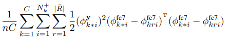

I wanted to write the code to calculate this value in a completely vectorized way, to allow pytorch to do it very quickly, but ultimately gave up and used simple for-loops. The final code can be found as the function `WSDDN.reg()`, in the file linked below.

The custom components I wrote can be found [here](./wsddn.py). A summary of each component is below:
- Region Proposals(`EdgeBoxes`)
    - Some code to wrap the OpenCV EdgeBoxes algorithm 
- Dataset (`CustomVOC`)
    - For one, I had to re-format the labels from VOC to be multiple one-hot vectors from a dictionary
    - I also wanted to return a set of region proposals along with each image, from the same class
- Augmentation (`BoxAndImageFlip`)
    - Since any augmentation performed on the image also has to be performed on the region proposals, I wrote custom transforms to do this
- Model itself (`WSDDN`)
    - This ones obvious
    - NOTE: I ended up using ROI pooling instead of SPP since it exists in PyTorch
- Visualization
    - I also added a bunch of functions to do visualizations into `CustomVOC`, since they shared some data
- Evaluation
    - I ended up using a package I found online, `mean_average_precision`, but the default version had a bug, so I used the latest version (`pip install --upgrade git+https://github.com/bes-dev/mean_average_precision.git`) instead
    - The function to format the bounding boxes for this library is in the `CustomVOC.format_pred()`

A result of all this work is that I am now very comfortable working with object detection. Having spent all my other reports doing classification, there were some nuances that comes with a new task, and there were some "growing pains" that I worked through. In addition, I have all these custom tools that are ready to be used for the final project, and will come in handy.

## Optimizing Reading the Data
After training a few epochs, I noticed that the training was happening really slowly, much slower than any other model I had trained. I looked at the GPU utilization and saw this:

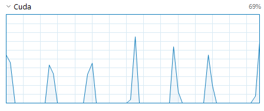

So this meant that the biggest bottlenech was not on the GPU, so it has nothing to do with the model's implementation. I realized that I was generating region proposals _each_ time I was fetching an image, and this is really slow. I also realized that the region proposal (based on OpenCV's EdgeBox algorithm) is deterministic, so there is no reason to do it on the fly, unless it is a new image. In addition, I was seeing an occasional crash in training where there were no proposed regions for a certain image. This was a hard bug to find, since errors when running on CUDA can be obfuscated. After doing some digging ([this notebook](./investigate_crash.ipynb)), I realized there was another problem: the images were being normalized _before_ the regions were being proposed, which degrades the information used by EdgeBoxes. So, I decided to add to the labels of each image the proposed regions. In [this notebook](./optimize_region_proposals.ipynb) I worked with the XML format that the labels are stored in to figure out how to do this, and then looped through all 11,000 images in the VOC dataset and added proposed regions to all the labels. The result is a much better utilization of the GPU:

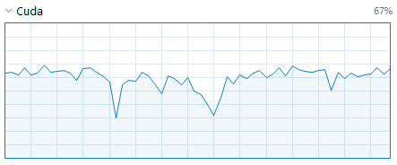

# Experiments
## Attempt 5

After a few false starts, I finally got this attempt to train, and let it run for a few hours. Here is the training loss and test mAP:

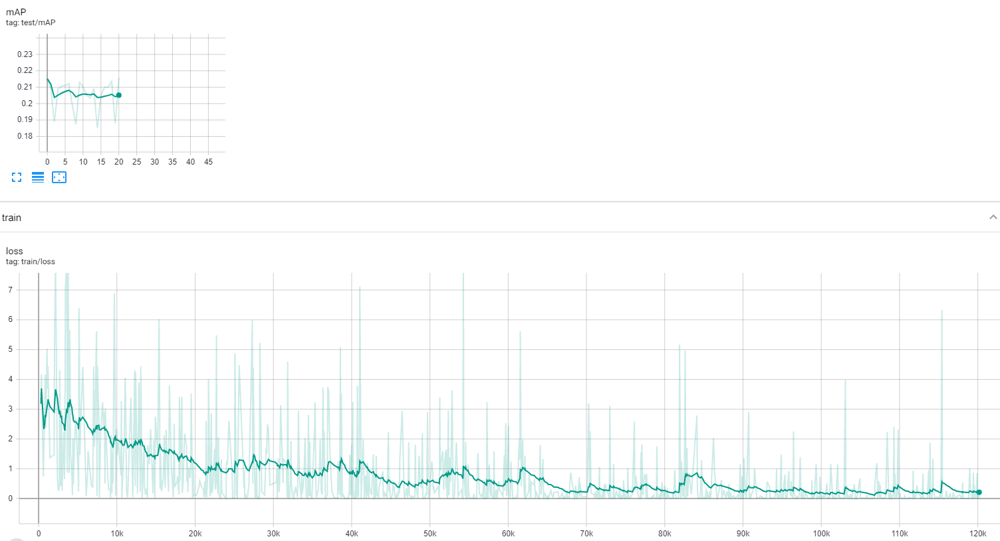

This model converged well, but the test mAP stayed at 0.2 for the entirety of training, which is slightly concerning. Looking at the second table below, this could be because large boxes with high overlap are dominating. Note also that the mAP is calculated on a small subset of test images (25) and so the plotted mAP is not fully indicative. **On the full set, the mAP is 0.12, a tad worse**

Some successes:

| Multi-Object Success |  Smaller Box | Really good box (but missed two objects) |
:-----------:|:----------:|:----------:
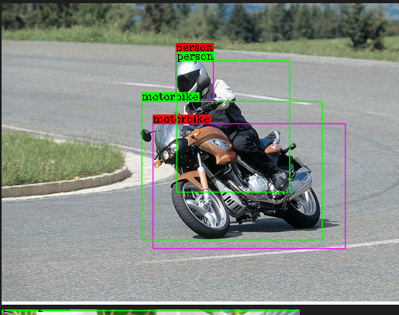  |  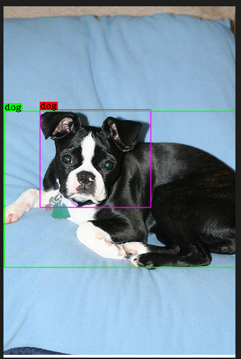 | 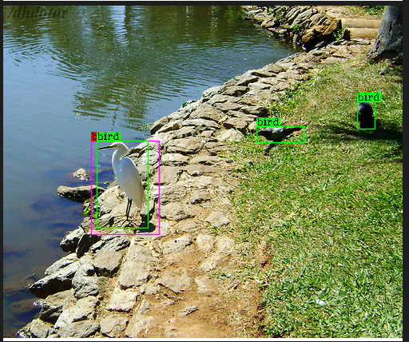
Here, the image is quite complex, but the model succeeded in recognizing the motorbike and the person | It is encouraging that the face is what is picked up by the model, since this is the important part of the object | Missing some objects, but those birds are harder to see. The bbox for the detected bird is really good though

In fact, most successes are a smaller subset of the GT box, possibly becayse the CNN learns low level features.

Some failures:

| Detecting the entire region | Two separate regions | Focused on head
:-----------:|:----------:|:----------:
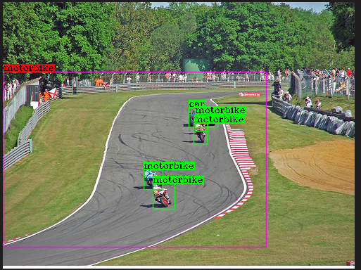 | 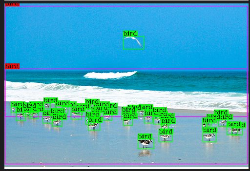 | 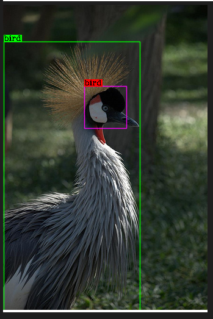
Although the correct class, this bounding box is completely wrong | What is interesting is that that there are two separate regions, for the two separate clusters of birds | As above, a smaller box on the head of the bird

And now, some fun ones:

| Ghost bus driver | Plant! | More into art than TV
:-----------:|:-------------------:|:----------------:
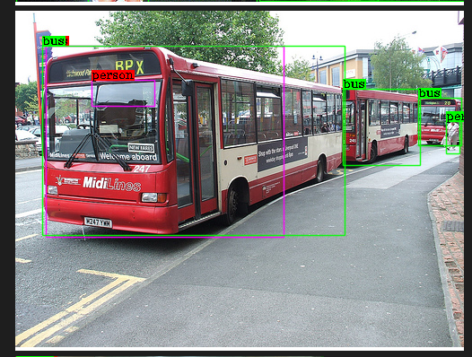 | 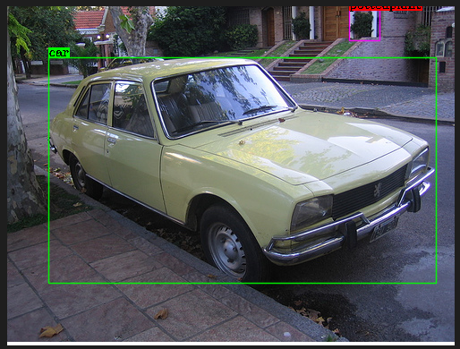 | 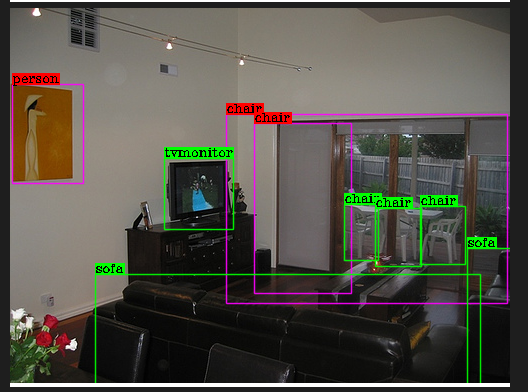
What is interesting is the FP of the person is in the driver seat. Most likely, bus pictures usually also have a person in that seat, so the model is spatially associating the two classes. | Although the model missed the car, it is cool that it picked up the plant in the background as a potted plant! | Again, the model missed the TV, and the chair boxes are too big, but the person in the painting is correctly identified (although not a GT box).

## Regularization Attempt 0
I then worked through the extra spatial regularization term which is meant to enforce consistency across the image for similar classes. I also ran the training for 20 epochs:

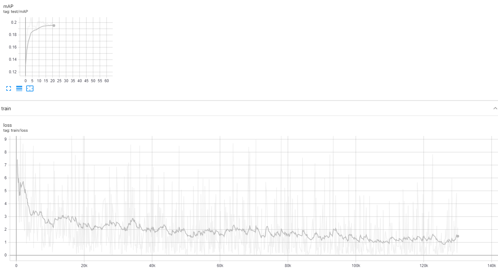

The loss did not converge as well as without the regularization, but what is encouraging is that the test mAP increases rapidly to start, showing the model is generalizing better. However, the model also seemed to flatline around 0.20 on the subset of images. **The mAP for all test images is 0.10.**

Some successes:

Success on simple object | Success on complicated scene | Success on hard objects
:--------:|:----------:|:--------:
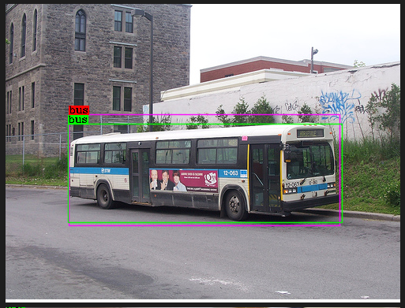 | 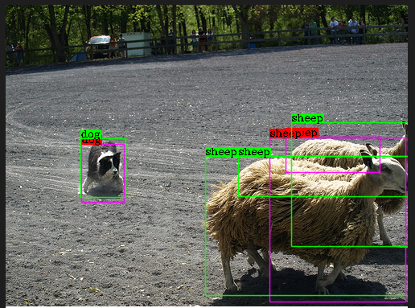 | 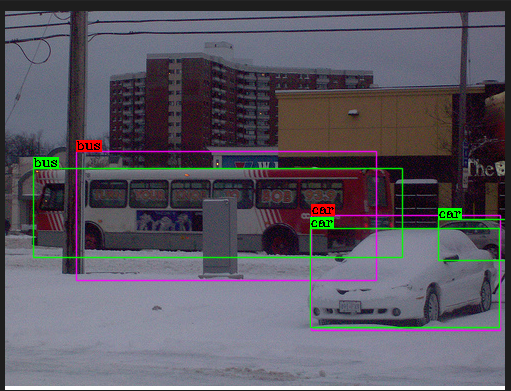
Here is a good box, on a simple image with little other objects | The model correctly gets the dog and two of the sheep! | This difficult image has a car and a bus, both which are detected well 

Some failure cases:

Right classes, one good one bad | Right class, but too many boxes | Bad FP
:------:|:-------:|:--------:
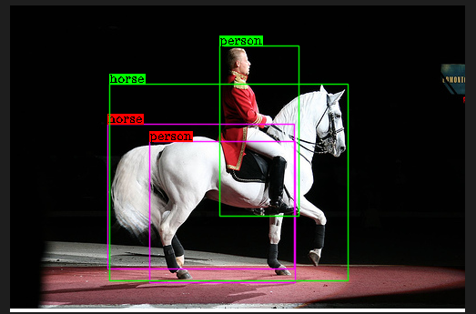 | 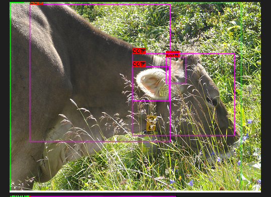 | 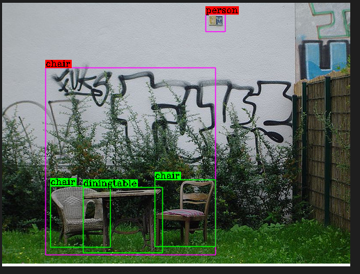
Here, both classes are correct, but the "person" box is very off | Although all the boxes are 'cow', there are too many. The different sizes explain why the NMS does not throw them out. | The square is a very interesting person. Also, the same pattern of large bounding boxes

Again, some more fun results:

| The model likes plants | The model REALLY likes plants! | Shadows
:-----------:|:--------:|:-------:
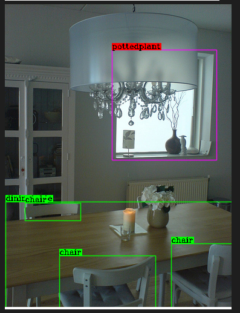 |  | 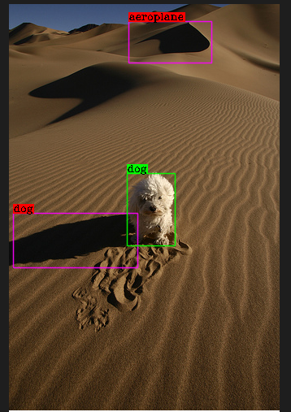
In my opinion, that is a potted plant, so I don't blame the model | The tree is plant-like, and the bird bounding box is contextually correct. The rest of the image is not great though | The shadow of the dog is detected which is really interesting, I wonder if the activations from the outline are similar

## Regularization Attempt 2
This run was done on the Google Cloud VM, to test it out. It took a bit of hacking since the vm had different versions of everything.

This time, I added a slightly lower weight to the regularization term, as well as some learning rate decay:

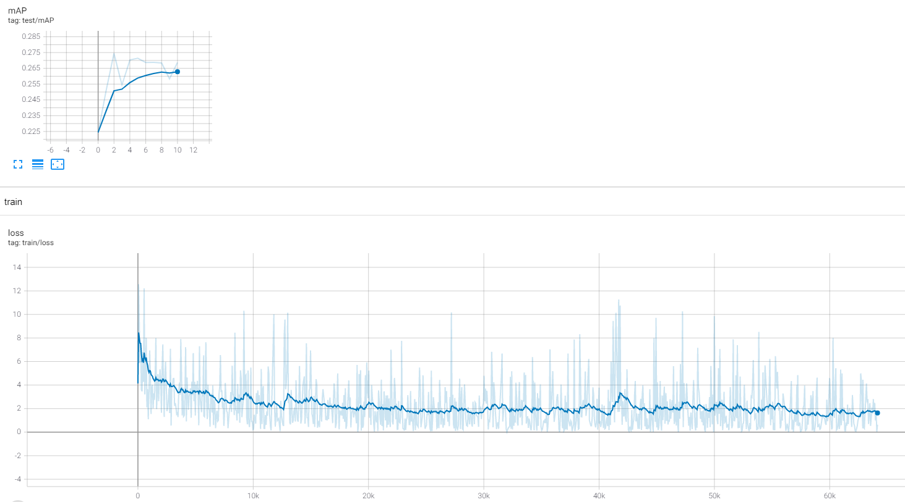

**This model achieved a mAP if 0.11**

Example detections are omitted, since they are similar to the last attempt.

## Notes on Attempts (for personal use)
- Attempt 0
    - Huge loss, since I was trying to use a batch size of 16 and accumulate loss
- Attempt 1
    - Switched to using a single image in a mini-batch
    - Loss blew up
- Attempt 2
    - Reduced learning rate to 1e-5, loss stayed low
    - `CUDA error: device-side assert triggered` towards the end of epoch 0
- Attempt 3
    - Same as before, re-trying to see if I can get reproducibility
    - Happened again on batch 5100
- Attempt 4
    - Same as before, but set `CUDA_LANCH_BLOCKING` to 1, in order to get a full stack trace
    - Got the error on the loss function, so my guess is that negative values (or close to them) are what is causing the issue
- Attempt 5
    - Added `torch.clamp` to make sure no predictions are less than 0
    - Worked well!

- Reg Attempt 0
    - Added in reg term to the loss
- Reg Attempt 1
    - Set learning rate to slightly higher, crashes since loss blew up
- Reg Attempt 2
    - Brought learning rate back to 1e-4, added LR decay with gamma of 0.25 at 5 epochs, as well as multiplied reg. term by 0.25

